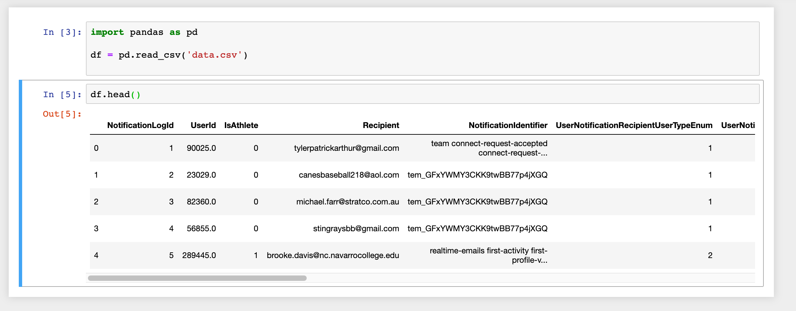

# Entry Level Data Analyst Take Home Project

## Purpose
The goal of this project help us understand your data analyst abilities.
We are providing you real datasets to explore which are drawn from FieldLevel applications.
We do not expect you to spend more than a few hours completing the exercise.

To complete the goal you should setup your system as described below and then edit the file Exercise.ipynb in a web browser using jupyter notebooks.

## Setup
#### Get the data and project code
1. Import the exercise repository to your personal Github account. Using github's import tool (https://github.com/new/import) import this url: https://github.com/FieldLevel/fieldlevel-entrylevel-da-take-home
1. Invite our github user "fl-codereview" to be a collaborator on your new repository
1. Get your new repository on your local machine
1. Unzip the data stored in `data.zip` to the project root. You should see two files, `email_data.csv` and `activity_data.csv`  

#### Run the programming environment
Before you start the exercise you'll need to get python 3 running and a jupyter server notebook.
The fastest way to do that on my mac was:

1. Install anaconda (https://docs.anaconda.com/anaconda/install/)
1. Navigate to repository in a console
1. Run `jupyter notebook`
1. Open webrowser (if it didn't open automatically) and navigate to http://localhost:[8888]/notebooks/Exercise.ipynb where [8888] is the port jupeter is running on.
1. Import the pandas library into the the first cell of the jupyter notebook and then load the datasets `email_data.csv` and `activity_data.csv` via the read csv function. The datasets are comma `,` delimited. 
Display the head of the dataframes. 
If you see something that looks like this you are setup and ready to start the exercise:

## Exercise
In this exercise we imagine you are working as the data analyst on a product team along side a product manager, developers, and designers. 
The team is looking to improve features related to the emails we send to our users.
To that end, the team is thinking it would be good for you review data related to emails we have been sending lately. 
They hope you will be able to answer some basic questions the group brainstormed at the project kickoof.

### About the datasets
Before you start your analysis, first review the descriptions of the datasets below to make sure you understand the data. If you have any questions about the meaning of a column contact us.
#### Dataset: email_data.csv
This is dataset contains samples of the emails we sent over about a year period. Each row represents an email that was sent to a user. This dataset represents a small fraction of the emails we have sent over the time period covered by the data.

Column Name | Description
--- | ---
LogId | A unique number used to represent each individual email that was sent
EmailSentDateTimeUtc | The date and time the email was sent in coordinated universal time
EmailCampaignId | A unique number used to represent each email campaign. Multiple users can recieve emails multiple times from the same email campaign.
EmailOpenedDateTimeUtc | The date and time the email was opened. Null if the user did not open the email
EmailClickedDateTimeUtc | The date and time the a link in the email was clicked by the user. Null if the user did not click any links in the email.
UserId | A unique number used to represent each user that is assigned in ascending order as users register at FieldLevel
AddressData | A string in JSON format. May be null as not all users have provided an address. The field contains the 5 digit zip code of an address the user provided. Note the format of the JSON object varies. A zipcode will always be identified by the key 'ZipCode'. Some 'ZipCode' keys are duplicated. Some have null values. Some are preceeded by extranious letters.

#### Dataset: activity_data.csv
This is dataset contains a daily log of user activity. If any user represented in the email_data was active on a day during the period covered by the email there will be a row in activity_data. If no row is present for a given UserId and date, you can assume that UserId was not active on that date. 

Column Name | Description
--- | ---
UserId | A unique number used to represent each user that is assigned in ascending order as users register at FieldLevel
DateOfActivityPST | A date a user made an authenticated request to our servers in pacific standard time.
ActivityCount | The number of pages/requests the user made on that day. Users who spend more time on FieldLevel have a higher activity count.

### Questions
For each question below create a new code cell in the Exercise.ipynb notebook. Start the code cell with a comment indicating the question it is answering. Then write and execute the code you feel is required to answer the question. Finally, if the question requires it, print a _brief_ response (1 or 2 sentences) summarizing your answer.
1. How many rows are in the two datasets? 
If the log of emails represents 3% of the emails we sent over this period, how many emails did we send?
(use python to print the numbers and display them nicely with commas)
1. What are the earliest and most recent dates of emails sent in this dataset in California time? (use python to print the date in format mm/dd/yyy hour:minute in 24 hour time)
1. Which 10 zip codes receive the most emails and how many emails do they receive?
1. Create a single line graph. 
Make sure the graph is communicates clearly to team members not used to looking at the data (e.g. the axis make sense, labels are clear, there's a title, etc.)
Plot two data sets: 
    - total distinct users who got at least 1 email by month
    - the monthly the percentage of users who were sent an email and were active the same day
1. All the emails we send contain at least one link users can click which should send them to the FieldLevel app (where they would login and become active for that day).
The team is curious if any of the links are broken (i.e. the email template has links to click but they are mis-configured and don't actually send people to our app).
Estimate how many emails (by EmailCampaignId) may have broken links.
If you find an EmailCampaignId that has possible broken links, estimate an upper bound for the number of users it has effected and the probability a user who gets email from us has experienced a broken link multiple times.
For your answer, write a paragraph using clear language that non-technical members of the team will understand.
1. The team's product manager is thinking we may be sending too much email. 
Is there a campaign that we should consider no longer sending? (e.g. its performance has never been good).
When looking at performance of the emails does time matter or do they perform consistently over time?
1. Almost every email that we send has a 'call to action' button that sends users to the FieldLevel app.
The team wants to experiment with the way the 'call to action' buttons are designed.
They have a new design that they think will encourage more people to click on the button.
In order to test the new design the team will select a group of users to experiment on.
They plan to separate the users who get email into two 'experimental groups':
    - an 'experiment' group whose emails will have the new button design after the experiment launch data
    - a 'control' group whose email will have the current button design after the experiment launch data    
The team wants to have about 50% of the users in the experiment assigned to the 'experiment' group and 50% assigned to the control group.
They are using the following rules to assign users to the groups:
    - Users with a userid between 20000000 and 1000000000000 will be included in the experiment
    - Users with a userid greater than 498689408027 will be the 'experiment' group
    - Users with a userid less than or equal to 498689408027 will be the 'control' group    
Once the experiment launches the team wants to track changes to the probability of an email getting clicked.
In preparation for the experiment launch, plot a graph comparing the probability a user clicks on an email for each of the two experimental groups aggregated on a daily basis.
In a paragraph, describe whether you think this is a good experimental design.
In particular, what is good about the strategy for assigning users to experimental groups and what concerns do you have.
1. Finally, the product manager is worried emails are not having the impact we think.
In particular they are concerned that unengaged users do not open or click on emails and because of this, efforts to re-engage users that focus on email will not be effective.
Explore the data, visualizing the relationship between emails sent and user activity both in login and activity count.
Write a paragraph to support or argue against the product managers concern.
Use statistical methods support your conclusion but balance that with plain language that non-technical users can understand.
